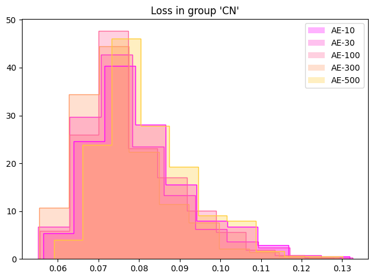

### Dato: 12. feb

# Forrige uke oppsummert:
- hidden dim må ver minst ca [10, 200, ...] med kernel size 3 for å capture 98% varians på kvert hidden lag i encoder ref [test_pca](../../test_pca.ipynb)
  vil også helst ha så få conv lag som mulig siden hvert lag mister noe varians (?).
- mer regularisering gjør bildene mer blurry men latent space penere. (kl loss gjør latent space mer gaussian).
- latent dim alene har ikke så mye å si.

# Plan for uken:
- finne ut hvor mange hidden dims som må være med i hvert conv lag.
- prøve å endre regulariserings-vektene mens vi trener.
- teste modellene på de forskjellige gruppene.
- se hvilke hjernedeler som har mest reconstruction loss --> lage en pipeline som tar inn MRI scan og gir ut highlighta plot av ROI med mest loss.
- teste histogram normalisering --> kan hende det gjør bildene lettere å memorisere.
- teste data augmentation
- se hvor høy stride vi kan ha. må ha færre parametre uten å gjør utgangsbilde mer blurry.
- Identifisere hvor i en modell mest informasjon går tapt (finne bottlenecken). finne ut hvor god metric (SSIM) vi i teorien skal kunne trene opp til ift. bottlenecken.
- trene classifier på latent space for hvilken gruppe (binary eller 3) hver pasient tilhører.

# Spørsmål og svar:
- burde vi implementere andres løsninger for å sammenligne deres performance med vår i rapporten, eller skal vi stole på at deres latent space oppfører seg på samme måte som vi prøver å få til/at det er sammenlignbart?

Neste møte: 